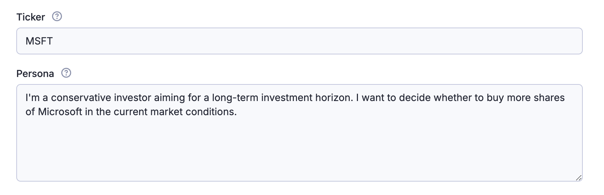

# Market Mind AI

## Get real-time market sentiment, summary and personalized investment recommendations for your stock ticker

Market Mind AI is a powerful finance monitoring agent designed to help you analyze market sentiment and make personalized informed investing decisions.

Market Mind AI uses advanced natural language processing (NLP) techniques to extract the most important insights based from social media and news articles.

Quickly try it by inputting the stock ticker you're interested in and your personal investing or research goal.

## Analyze market sentiment for your ticker symbol

1.  **Input Ticker**: Input the stock ticker (e.g., `TSLA`, `NVDA` or `MSFT`) to analyze current sentiment for the company of your interest.
2.  **Define Persona**: Describe the type of investor you are (e.g., conservative, aggressive), risk tolerance, investing horizon, and use case for the analysis.
    This information helps tailor the analysis to your investing style.

**Input field example:**

**Structured data input example:**

```json
{
    "ticker": "MSFT",
    "persona": "I'm a conservative investor with aiming for long-term investment horizon. I want to decide whether to buy more shares of Microsoft in the current market conditions."
}
```

### Social media sentiment analysis

Market Mind AI analyzes social media platforms like [X (Twitter)](https://x.com/) to provide real-time insights into market sentiment. It automatically aggregates tweets related to your ticker symbol and analyzes the sentiment to provide a comprehensive overview of the market.

#### Most influential tweets detection

It can automatically detect the most important tweets based on the `number of likes`, `retweets`, and the `influence of the author`.

### News sentiment analysis

Market Mind AI aggregates news articles from Google News and analyzes the sentiment to provide a comprehensive overview of the market for your ticker symbol.

As a source of real-time information, Google News provides a broad range of articles from reputable sources as [The Wall Street Journal](https://www.wsj.com/), [Bloomberg](https://www.bloomberg.com/), [Yahoo Finance](https://finance.yahoo.com/), or [Seeking Alpha](https://seekingalpha.com/), ensuring you receive the most up-to-date information for your analysis.

#### Most read articles detection

It can automatically detect the most important articles based on the `article position`, `source`, and the `publication date`.

## Sentiment analyses structured data output

```json
[
    {
        "sentiment_analysis": {
            "google": {
                "category": "Positive",
                "confidence": 85,
                "sentiment_score": 8,
                "reasoning": "The sentiment across reputable sources like Forbes, Yahoo Finance, and Morningstar about Microsoft's recent financial performance, AI advancements, and strategic investments is largely positive. The company's revenue has beaten expectations, and there is bullish sentiment regarding its long-term growth potential, particularly in AI and cloud sectors."
            },
            "twitter": {
                "category": "Positive",
                "confidence": 70,
                "sentiment_score": 7,
                "reasoning": "On Twitter, there are several positive endorsements from finance and tech enthusiasts, praising Microsoft's advancements in quantum computing and AI. Many tweets express optimism about Microsoft's future performance although with slightly less authority compared to traditional media."
            }
        }
    }
]
```

### Market sentiment summary structured data output

```json
{
    "market_summary": {
        "current_situation": "Microsoft is experiencing strong performance in its AI and cloud sectors, with significant growth reported in these areas. However, there are concerns regarding execution challenges and supply constraints in the cloud unit.",
        "top_discussed_topics": [
            "AI and cloud growth",
            "quantum computing advancements",
            "revenue and earnings performance"
        ],
        "recent_information": [
            "Microsoft reported revenue exceeding expectations at $69.6 billion for Q2 2025.",
            "Significant AI partnerships and investments are strengthening their market position.",
            "Challenges in the cloud business and cautious guidance affected short-term sentiment."
        ],
        "investor_interest": "Investors are highly interested in Microsoft's AI initiatives and long-term growth potential, despite short-term challenges in other sectors."
    }
}
```

## Personalized investment recommendations

Market Mind AI provides personalized investment recommendations based on your investing persona and the sentiment analysis of the market. It tailors the analysis to your investing style, risk tolerance, and investment horizon, ensuring you receive the most relevant insights for your investing decisions.

### Personalized investment recommendations structured data output

```json
{
    "personalized_recommendation": {
        "persona_analysis": "As a conservative investor with a focus on long-term growth, stability and risk aversion are your priorities. You seek investments with predictable profitability and robust fundamentals.",
        "action": "Buy",
        "summary": "Based on the positive sentiment and strong market position, Microsoft presents a solid investment opportunity for long-term growth. The company's focus on AI and cloud services aligns with trends in tech innovation, offering stability and growth potential.",
        "reasoning": "The overall confidence in Microsoft's growth trajectory, especially in AI and cloud computing, matches your long-term investment goals. Given the positive sentiment and opportunities in AI, it is advised to increase your position in Microsoft, while monitoring its execution in cloud services.",
        "potential_risks": [
            "Potential execution issues in the cloud business affecting future growth.",
            "Global economic uncertainties could impact tech spending.",
            "Increasing competition in AI and cloud sectors."
        ]
    }
}
```

## Comprehensive personalized market sentiment analysis **under 1$**

#### Pricing explanation

Market Mind AI operates under the [Pay Per Event (PPE)](https://docs.apify.com/sdk/js/docs/next/guides/pay-per-event) monetization model, which provides flexible pricing based on defined events.

| Event                        | Description                                                                       |
| ---------------------------- | --------------------------------------------------------------------------------- |
| Actor Start                  | Fixed fee for starting an Actor run at **$0.03**                                  |
| Google News Article Analysis | Aggregate articles from Google News for **$0.354**                                 |
| Tweet Analysis               | Analyze tweets from X for a fee of **$0.354**                                      |
| Market Sentiment Analysis    | Perform sentiment analysis generating summaries and recommendations at **$0.262** |

[Apify's platform](https://docs.apify.com/platform) enhances Market Mind AI with API access, scheduling capabilities, and data storage options for your convenience and flexibility.

**FAQ, Disclaimers, and Support**

**Is it legal to use Market Mind AI for scraping data?**
Market Mind AI operates within ethical guidelines and does not extract private user data.

**What if I encounter issues?**
Direct any technical feedback to our [help and support](https://help.apify.com/en/).

**Your Feedback**
We are constantly working on improving Market Mind AI. Please provide feedback or report any issues.

Thank you for choosing Market Mind AI for your financial analysis needs!
